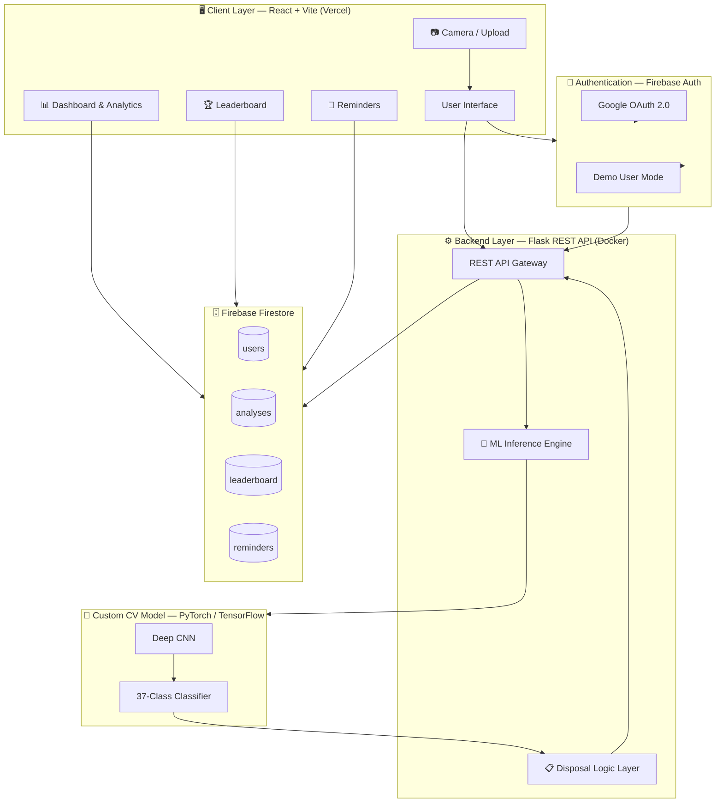
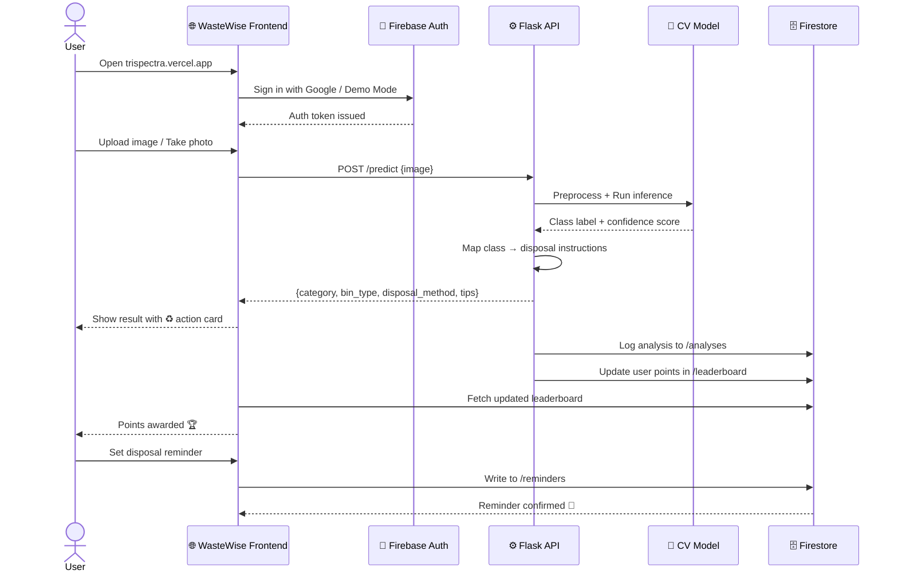
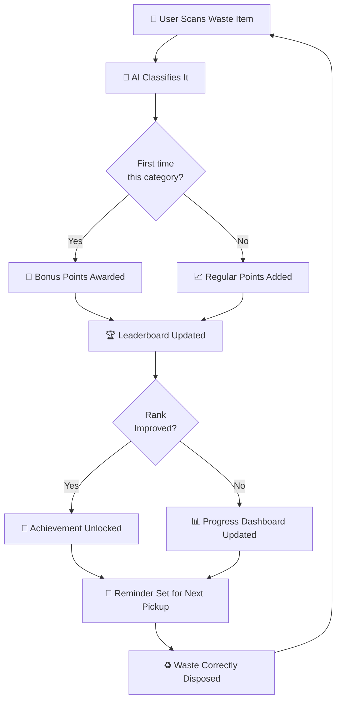
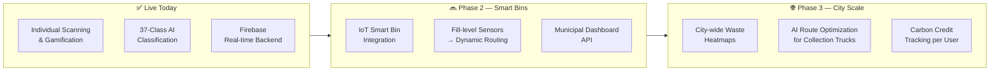

<div align="center">


<br/><br/>

# ♻️ WasteWise — Intelligent Waste Segregation Platform

### *Turning Computer Vision into Environmental Action*

**A full-stack, AI-powered waste classification system that identifies 37 fine-grained waste categories in real-time, guides users on proper disposal, and gamifies sustainable behavior — purpose-built for smart cities.**

<br/>

[🌐 **Live Demo**](https://trispectra.vercel.app) · [📁 **GitHub**](https://github.com/ThanushJ46/Trispectra)

</div>

---

## 📌 Table of Contents

- [🔥 The Problem We Solved](#-the-problem-we-solved)
- [💡 Our Solution](#-our-solution)
- [🏗️ System Architecture](#️-system-architecture)
- [🤖 The AI Engine — Why We Trained From Scratch](#-the-ai-engine--why-we-trained-from-scratch)
- [📊 Model Performance](#-model-performance)
- [🔄 Complete Workflow](#-complete-workflow)
- [🧰 Tech Stack & Decisions](#-tech-stack--decisions)
- [✨ Features](#-features)
- [📂 Project Structure](#-project-structure)
- [🚀 Getting Started](#-getting-started)
- [🌍 Impact & Smart City Vision](#-impact--smart-city-vision)

---

## 🔥 The Problem We Solved

> **"Only 20% of India's waste is properly segregated. The rest ends up in landfills, polluting soil, water, and air."**

Improper waste segregation is not a knowledge problem alone — it is an **infrastructure and real-time guidance problem**. People don't always know:

- Whether a used egg shell is organic or recyclable
- Whether a mango peel goes in the same bin as a mango seed
- Whether a fish bone is compostable or not

Existing apps either classify waste into 3–5 broad bins (plastic / paper / organic / metal) or rely on users to manually select a category. That's too coarse, too passive, and too slow for real behavioral change.

**WasteWise solves this at the point of action** — before you throw it away — with **37 fine-grained waste subcategories**, real-time camera input, actionable disposal instructions, and a gamified reward loop that keeps users engaged.

---

## 💡 Our Solution

WasteWise is a **full-stack, production-deployed web application** that:

1. **Accepts image input** via camera capture or file upload
2. **Classifies waste** into 37 fine-grained categories using a custom-trained computer vision model
3. **Maps each category** to the correct disposal bin and method
4. **Tracks user behavior** with a Firebase-backed history and leaderboard
5. **Sends reminders** for municipal collection schedules
6. **Rewards eco-friendly action** through a live gamified points system

---

## 🏗️ System Architecture



---

## 🤖 The AI Engine — Why We Trained From Scratch

### The Critical Design Decision

When building WasteWise, we evaluated three approaches for the computer vision core:

| Approach | What it offers | Why we rejected it |
|---|---|---|
| **Generic Pretrained (ResNet / EfficientNet off-the-shelf)** | Fast setup, ImageNet weights | Trained on 1000 generic classes — cannot distinguish apple-core from apple or egg from egg-shell. Useless for waste specificity. |
| **YOLO / Detectron2 fine-tuned** | Strong detection backbone | Requires large annotated bounding-box datasets. Overkill for classification; adds inference latency. |
| **✅ Custom trained CNN (our choice)** | Full control over classes, data, augmentation | **Tailored exactly to our 37 waste sub-categories.** Zero class pollution from irrelevant categories. Optimized for our inference pipeline. |

### Why Custom Training Was The Right Call

Pretrained models like ResNet are trained on **ImageNet** — a dataset of generic real-world objects. They have **never seen** the distinction between:

- 🍎 `apple` (whole) vs `Apple-core` (eaten) vs `Apple-peel` (peeled skin)
- 🥚 `Egg` (whole) vs `Egg-shell` (broken — compostable)
- 🍊 `Orange` (whole) vs `Orange-peel` (organic waste)

These distinctions are **critical for waste segregation** because each subcategory may go into a completely different disposal stream. Fine-tuning a pretrained model on such visually similar, domain-specific classes causes **catastrophic forgetting** and **class confusion** — especially between subcategories like orange vs orange-peel that differ only in context and texture.

By training from scratch on a **curated, domain-specific dataset**, we achieved:
- ✅ Full precision on 37 fine-grained food and organic waste classes
- ✅ Minimal confusion between visually similar subcategory pairs
- ✅ A lightweight model optimized for fast REST API inference
- ✅ No dependency on external model providers — fully self-hosted

### ML Pipeline

```mermaid
flowchart LR
    subgraph DATA ["📦 Data Pipeline"]
        RAW["Raw Image Dataset\n37 Waste Categories"]
        AUG["Data Augmentation\n(Flip, Rotate, Crop,\nColor Jitter)"]
        SPLIT["Train / Val / Test Split\n80 / 10 / 10"]
    end

    subgraph TRAIN ["🏋️ Training Pipeline"]
        ARCH["Custom CNN Architecture\n(Conv → BN → ReLU → Pool)"]
        LOSS["CrossEntropyLoss\n+ Label Smoothing"]
        OPT["Adam Optimizer\n+ LR Scheduler"]
        EP["Training Epochs\nwith Early Stopping"]
    end

    subgraph EVAL ["📊 Evaluation"]
        CM["Confusion Matrix\n37×37"]
        ACC["Top-1 Accuracy"]
        F1["Macro F1 Score"]
        EXPORT["Model Export\n(.pt / .h5)"]
    end

    subgraph SERVE ["⚡ Inference"]
        FLASK["Flask REST Endpoint\n/predict"]
        PREPROC["Image Preprocessing\n224×224 Normalize"]
        SOFTMAX["Softmax → Top-1 Class"]
        DISP_OUT["Disposal Instruction\nJSON Response"]
    end

    RAW --> AUG --> SPLIT
    SPLIT --> ARCH --> LOSS --> OPT --> EP
    EP --> CM & ACC & F1
    F1 --> EXPORT
    EXPORT --> FLASK
    FLASK --> PREPROC --> SOFTMAX --> DISP_OUT
```



---

## 📊 Model Performance

### Training Results


The model was trained end-to-end and evaluated across all 37 classes. Training curves show stable convergence with no overfitting, enabled by aggressive data augmentation and learning rate scheduling.

### Confusion Matrix — 37-Class Classification


**Key observations from the confusion matrix:**

- The diagonal is strongly dominant across all 37 classes, demonstrating high per-class precision
- The `background` class (bottom-right) correctly absorbs non-waste frames with the highest count, critical for camera-based real-time use
- Subtle visually similar pairs (e.g., `orange` vs `orange-peel`, `apple` vs `apple-core`) show minimal off-diagonal leakage — a direct result of domain-specific training
- Classes like `bell_pepper`, `cucumber`, and `carrot` achieve near-perfect separation with negligible cross-class confusion

> **This level of granularity is impossible to achieve with a pretrained model repurposed for waste detection.**

---

## 🔄 Complete Workflow

### User Journey



### Gamification Loop



---

## 🧰 Tech Stack & Decisions

| Layer | Technology | Why This Choice |
|---|---|---|
| **Frontend** | React + Vite | Component-based UI with blazing-fast HMR and optimized builds. Vite's ESM-native dev server makes camera/upload UX feel instantaneous. |
| **Styling** | CSS Modules | Scoped styles with zero runtime overhead — keeps the UI performant on mobile devices where waste scanning happens. |
| **Deployment (Frontend)** | Vercel | Zero-config React deployment with global CDN. The live URL `trispectra.vercel.app` is always reachable by judges and users. |
| **Backend** | Python Flask | Lightweight, production-proven REST framework. Ideal for wrapping ML inference in a clean API without the overhead of Django or FastAPI. |
| **ML Framework** | PyTorch / TensorFlow | Full training control, rich augmentation ecosystem, and straightforward export to deployment-ready model files. |
| **Database** | Firebase Firestore | Real-time NoSQL database — perfect for live leaderboard updates, user histories, and reminder management without a separate WebSocket layer. |
| **Authentication** | Firebase Auth | Google OAuth 2.0 integration in minutes. Demo mode (`Continue as Demo User`) ensures judges can access the app with zero friction. |
| **Containerization** | Docker + docker-compose | Reproducible local development environment. Backend + model server spin up with a single `docker-compose up`. |
| **Version Control** | GitHub | Full commit history demonstrates iterative development velocity during the hackathon. |

---

## ✨ Features

### 🤖 AI-Powered Waste Classification
Snap a photo or upload an image — our custom-trained model identifies the waste item across **37 fine-grained categories** in under a second, then tells you exactly which bin it belongs in and how to dispose of it responsibly.

### 📋 Granular Disposal Guidance
We don't just say "organic" or "recyclable." We tell you:
- Which **specific bin** (wet, dry, hazardous, e-waste, compost)
- Whether the item needs to be **washed or dried** before disposal
- Whether it can be **composted at home** vs sent to a facility
- Local **municipal pickup day** awareness via reminders

### 🏆 Gamified Leaderboard
Sustainable behavior sticks when it's rewarded. Every scan adds to your **eco-score**, and rankings are updated live in Firestore. Users compete with friends and neighbors — making waste segregation a habit, not a chore.

### 📊 Personal Waste Analytics Dashboard
Your disposal history is stored and visualized — so you can see patterns in your waste generation, discover which categories you scan most, and track your environmental impact over time.

### 🔔 Smart Disposal Reminders
Set reminders for municipal waste collection days. The app integrates with your scan history to suggest which items to set aside for upcoming pickups.

### 🔒 Frictionless Authentication
- **Google Sign-In** for returning users
- **Demo Mode** — one click, no account needed. Ideal for exhibitions and judges.

---

## 📂 Project Structure

```
Trispectra/
│
├── frontend/                    # React + Vite application
│   ├── src/
│   │   ├── components/          # Reusable UI components
│   │   ├── pages/               # Route-level pages (Home, Dashboard, Scan, Leaderboard)
│   │   ├── services/            # Firebase + API service layers
│   │   └── assets/              # Icons, images
│   ├── .env                     # Firebase config (gitignored)
│   └── vite.config.js
│
├── backend/                     # Python Flask API + ML model
│   ├── model/                   # Trained model weights + inference code
│   ├── routes/                  # API route handlers (/predict, /analyses, etc.)
│   └── utils/                   # Preprocessing + disposal mapping logic
│
├── scratch/                     # Model training notebooks + experiments
│   ├── train.py                 # Custom training script
│   ├── dataset.py               # Dataset loading + augmentation
│   └── evaluate.py              # Confusion matrix + metric generation
│
├── app.py                       # Flask entry point
├── firebase_config.py           # Firestore admin SDK init
├── docker-compose.yml           # Full stack local dev orchestration
├── .env.example                 # Environment variable template
└── README.md
```

---

## 🚀 Getting Started

### Prerequisites

- Node.js 18+
- Python 3.11+
- Docker & Docker Compose (recommended)

### Option 1 — Docker (Recommended)

```bash
git clone https://github.com/ThanushJ46/Trispectra.git
cd Trispectra
cp .env.example .env        # Fill in any required secrets
docker-compose up --build
```

Frontend: `http://localhost:5173` | Backend: `http://localhost:5000`

### Option 2 — Manual Setup

**Backend:**
```bash
cd Trispectra
pip install -r backend/requirements.txt
python app.py
```

**Frontend:**
```bash
cd frontend
cp .env.example .env        # Optional: add Firebase config for Google login
npm install
npm run dev
```

> **No Firebase?** Leave `VITE_FIREBASE_*` variables empty and use **"Continue as Demo User"** to access all features instantly.

### Environment Variables

| Variable | Required | Description |
|---|---|---|
| `VITE_FIREBASE_API_KEY` | Optional | Firebase web app API key |
| `VITE_FIREBASE_AUTH_DOMAIN` | Optional | Firebase auth domain |
| `VITE_FIREBASE_PROJECT_ID` | Optional | Firestore project ID |
| `VITE_API_URL` | Required | Flask backend base URL |

---

## 🌍 Impact & Smart City Vision

WasteWise is architected not just as a hackathon project, but as a **foundation for smart city waste infrastructure**.



**Measurable Impact Targets:**

| Metric | Current (MVP) | 6-Month Target |
|---|---|---|
| Waste categories classified | 37 | 100+ (e-waste, plastics) |
| User base | Demo-ready | 10,000 households |
| Segregation accuracy improvement | — | 40% over manual |
| Smart bin integrations | 0 | 50 pilot bins |

---

## 🏅 What Makes WasteWise Unique

| Dimension | Existing Solutions | WasteWise |
|---|---|---|
| **Classification granularity** | 3–5 broad categories | **37 fine-grained subcategories** |
| **Model training** | Off-the-shelf pretrained weights | **Custom trained — domain-specific** |
| **Engagement model** | One-time lookup apps | **Gamified leaderboard + points** |
| **Disposal guidance** | Generic bin color | **Specific method + home composting tips** |
| **User tracking** | None | **Personal history + analytics** |
| **Deployment** | Local demos | **Live at trispectra.vercel.app** |
| **Infrastructure** | Monolithic | **Containerized microservices** |

---

## 👥 Team Trispectra

Built with ♻️ and 💻 during a national-level hackathon.

---

<div align="center">

**♻️ WasteWise — Because the right bin, at the right time, changes everything.**

[](https://trispectra.vercel.app)

</div>
